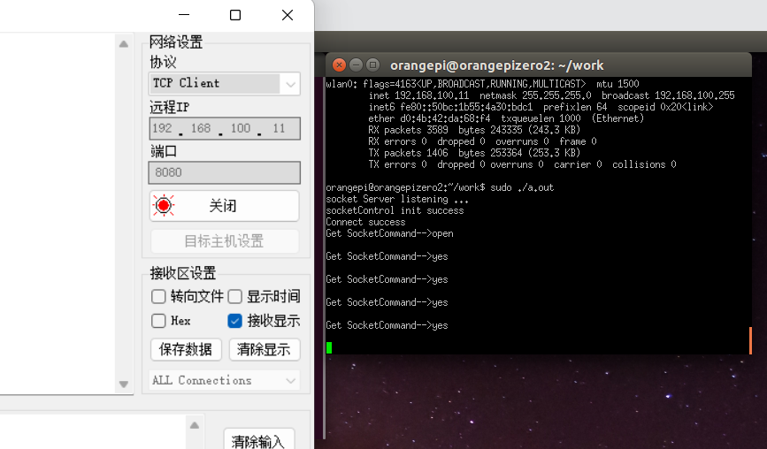

# 🚀smart-home

## 效果介绍

* 实现了一个可以通过语音控制，也可以通过网络调试助手或者Windows下的终端telnet服务控制灯，舵机，也可以实现监控此时的开发板各个模块的状态，可通过串口也可通过同一局域网下，网络监控。

## 初期环境搭建
* 详细参考文档  [智能家居这个项目文档](https://blog.csdn.net/Zy_1213/article/details/126679238)

* 如何烧入Linux系统到全志开发板【香橙派开发文档详解】

* 网络搭建，可以通过一个路由器实现ftp服务，也就是通过filezilla，同时也可以使用虚拟机中`PUTTY`服务实现与开发板相连接，既然可以通过`putty`那么是不是也可以使用**scp**命令去传输开发文件。

* 

* 同时要记得移植wiringOP`这个库，因为树莓派是专用的，其他开发板没有这个硬件信息，所以移植`wiringPi`这个库没有用。

* 编译选项

  ````
  gcc *.c -lwiringPi -lwiringPiDev -lpthread -lm -lcrypt -lrt
  //  *.c 所有.c文件
  //  需要链接库
  sudo ./a.out
  ````

## 开发过程

* 添加语音控制模块时， 需要去[语音模块官网生成SDK](http://www.smartpi.cn/#/productManage)【其实也很简单】

  读取时记得是按接收数据的位置读取，如下对应的位置

  ````c
  void *voiceControlThread(void *data)			//“语音控制线程”执行函数
  {   
      while(1){
          memset(voiceHandler->command,'\0',sizeof(voiceHandler->command));
          nread = voiceHandler->getCommand(voiceHandler);
          if(nread == 0){                                 //串口没有获取到指令
              printf("No voiceCommand received\n");
          }else{											//获取到指令
              printf("Get VoiceCommand -->%d\n",voiceHandler->command[0]);  //对应的位置      
          }
  }
  ````

* 添加网络测试【可以使用`网络助手工具`  也可以使用`windows`中的命令窗口使用`telnet`这个服务】，具体功能如下:

  ```C
  telnet 192.168.100.11 8080
  ```

  

* 

* 三线程同时工作测试，无其他问题
* 

## 问题

* 发现一个问题，就是通过`filezilla`传输**wiringOP**库的时候会出现不能运行的问题，这可能是x86架构和arm架构下的权限问题还是什么，反正就是不能正常运行。那么通过在开发板中在`github`上克隆下来的可以正常运行。
* 注意`filezilla`这个软件传输文件夹有权限问题，所以当要编译的时候，可以再开发板中创建文件夹，然后通过ftp传输单个文件，这样就不会涉及到最后的权限问题。
* 如果要使用摄像头进行人脸识别选项，需要使用orangepi的桌面版。
* 注意在使用这个的时候记得一定进行引脚的初始化，语音模块或者网络连接后，都需要进行初始化。

## 创新点

* 利用了c++的工厂模式的特性，可以很好的知道通过链表去调用，也能很好理解像Linux驱动底层的ops函数操作集的函数调用流程。
* 利用好了结构体，进行一个封装。
* 利用到了多线程这个概念，同时也是用到了很多的链接库。
* 利用到了多个可执行文件的相互关联操作。

## 引脚等说明

* 

## 完整效果图


## 其他的后续再补充，有用的话记得点星星~